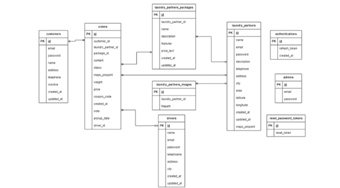

# 🚀 Project RPL Kelompok 2 P2 — Mitra Apps Laundry Frontend (React Native + Expo)


## 👥 Identitas Kelompok

Kelompok 2 - Rekayasa Perangkat Lunak

| Nama                        | NIM           | Tugas Utama                             |
|-----------------------------|---------------|-----------------------------------------|
| Mutia Saniya Rahma         | G6401231002   | UI Design                               |
| Fikri Nurhaekal            | G6401231030   | UI Design                               |
| Muhammad Rafi’ Pangestu    | G6401231058   | Frontend Development                    |
| Muhammad Alif Qalbiy       | G6401231084   | Frontend Development                    |
| Anargya Isadhi Maheswara   | G6401231118   | Backend Development                     |

---

## 📱 Deskripsi Singkat Produk

Ini adalah aplikasi mobile untuk **Mitra Laundry** yang dikembangkan dalam rangka Proyek RPL Kelompok 2 P2 menggunakan **React Native** dengan **Expo**. Aplikasi ini dirancang untuk mempermudah mitra dalam mengelola pesanan laundry, melihat detail pelanggan, dan mempercepat proses layanan digital laundry.

---


## 🧭 Fitur Utama

- Login Mitra Laundry
- Dashboard Order
- Kalender Pemesanan
- Profil Mitra Laundry
- Perbarui Status & Harga Pesanan
- Riwayat Pesanan

---


## 🗂️ Diagram 

Berikut adalah beberapa diagram dari sistem:

### Use Case Diagram
  

### Entity Relationship Diagram (ERD)  
  

### Class Diagram
  

### Activity Diagram
  
  

---

## 📸 Screenshot Tampilan Fitur


### Splash Screen, Login, Dashboard, Kalender


### Profile, Cek Status dan Update Harga


### Riwayat Pemesanan


---

## 📦 Teknologi yang Digunakan

- [React Native](https://reactnative.dev/)
- [Expo](https://expo.dev/)
- [Expo Router (File-based Routing)](https://docs.expo.dev/router/introduction/)

---

## 🔧 Cara Menjalankan Proyek

1. **Install dependencies**

   ```bash
   npm install
   ```

2. **Jalankan aplikasi**

   ```bash
   npx expo start
   ```

   Setelah itu, kamu bisa memilih untuk membuka aplikasi di:

   - [Development Build](https://docs.expo.dev/develop/development-builds/introduction/)
   - [Android Emulator](https://docs.expo.dev/workflow/android-studio-emulator/)
   - [iOS Simulator](https://docs.expo.dev/workflow/ios-simulator/)
   - [Expo Go](https://expo.dev/go) (fitur terbatas)

---

## 📁 Struktur Proyek

Pengembangan dilakukan dalam folder `app/` menggunakan sistem **file-based routing** dari Expo Router. Kamu bisa mulai coding dengan mengedit atau menambahkan file di dalam folder tersebut.

---


